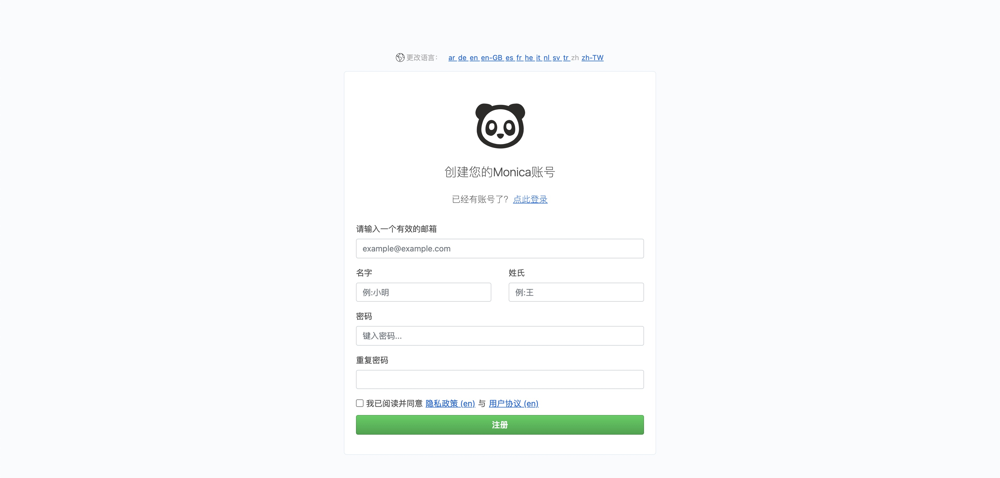
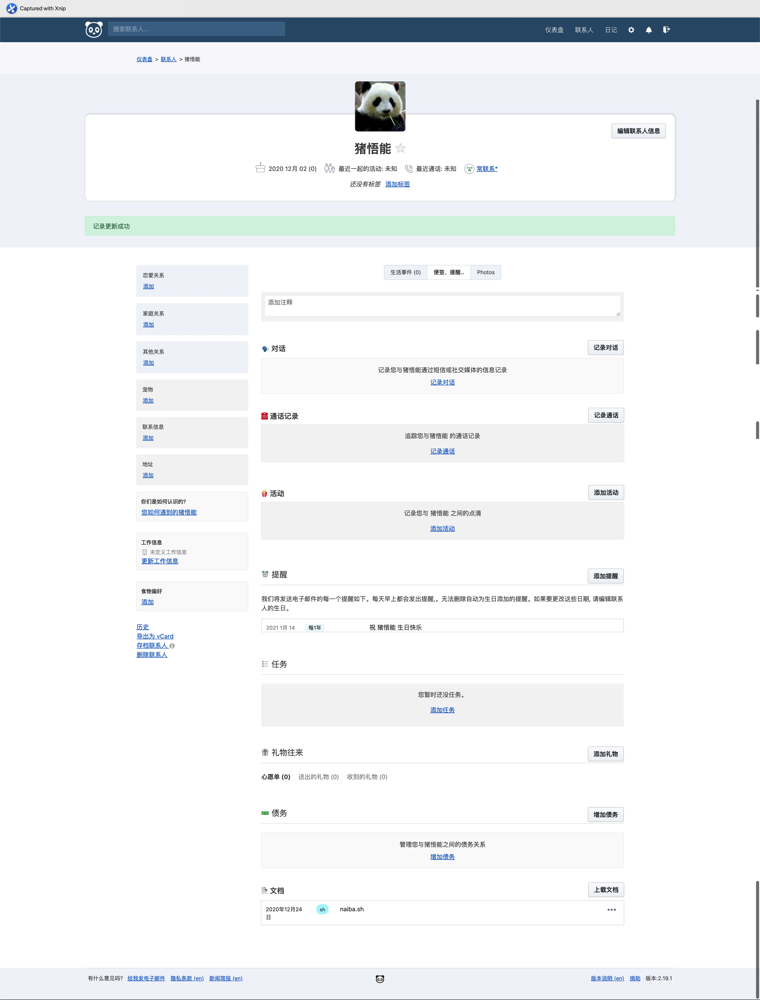

# Monica Fork

 <a href="README.md">
    
</a>

**Feel free to add the features you need, we have no CI, no style-lint, and no paying users to worry about**

The difference between this fork and upstream:
1. Support the reminder of lunar calendar (lunar calendar) dates (very important, many people celebrate birthdays and anniversaries in the lunar calendar)
2. Added permission verification for access to storage (eliminating the risk of exhaustive photos and documents)

## Installation guide

1. Please pre-install Docker, `docker-compose`
    ```
    mkdir monica && cd monica
    wget https://raw.githubusercontent.com/naiba/monica-fork/master/docker-compose.yml
    wget -O .env https://raw.githubusercontent.com/naiba/monica-fork/master/.env.example
    mkdir -p storage/framework/sessions
    mkdir -p storage/framework/cache
    mkdir -p storage/framework/views
    docker-compose up -d
    ```
2. Modify the configuration items in `.env`
3. Initialize the database
    ```
    docker-compose exec mariadb mysql -uroot -pmysqrootpass -e "CREATE DATABASE monica CHARACTER SET utf8 COLLATE utf8_general_ci;"
    ```
4. Initialize the system
    ```
    docker-compose exec monica php /monica/artisan key:generate
    docker-compose exec monica php /monica/artisan migrate
    ```
4. Visit `ip:8080`, you can use reverse proxy to wrap it

## Screenshot

### Home



### Contact



\# **Do you want to add more calendars (Buddhist, Islamic, Japanese)?**
1. Add a translation in `resource/lang/en/people.php`, search for `reminders_calendar_lunar`. For example: add `reminders_calendar_buddhist` after `reminders_calendar_lunar`.
2. Realize the corresponding Gregorian date conversion operation in `convertToSolarCalendarDate` and `addTimeAccordingToFrequencyType` in `app/Helpers/DateHelper.php`.

This project forks from [Monica](https://github.com/monicahq/monica) in December 2020
